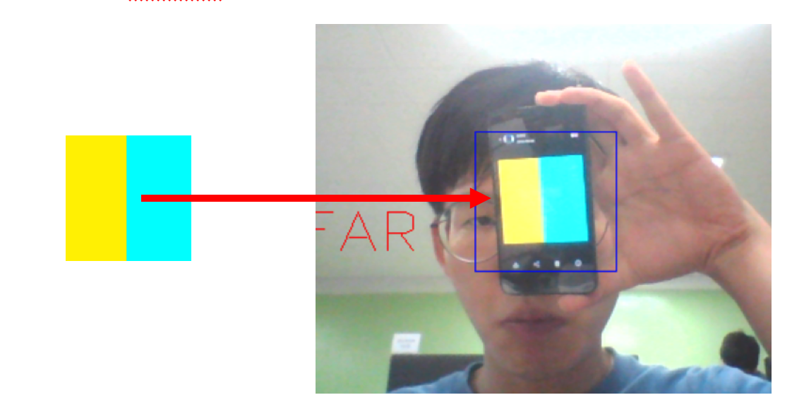
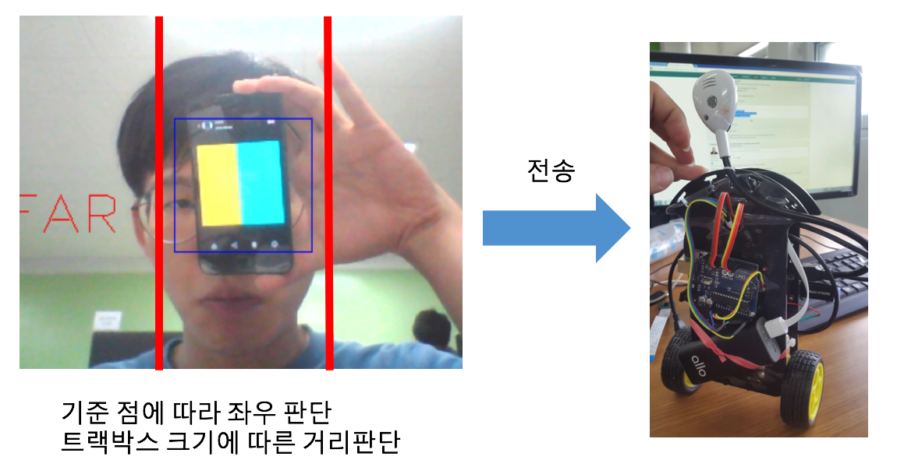

Tamplate 추적
---------

## 소개
팀 프로젝트[(링크)](https://drive.google.com/file/d/1tH7413AHH8auTWcvLQJTC-X4ryYb7-Xg/view?usp=sharing)에서 담당한 부분 입니다. Camshift를 이용해 템플릿을 추적하고 상대적인 위치를 나타냅니다.

## 동작
사전에 지정한 템플릿을 찾아 내고 윈도우로 표시하합니다.(사진의 파란 네모)


찾은 템플릿의 상대적인 위치를 표시합니다.(FAR, NEAR,LEFT, RGIHT)



## 요구 사항
OpenCV 2.4, CMake, CLion(권장)

## 빌드 및 실행
### OSX Console
```
cd <이 프로젝트의 CMakeLists.txt 경로>
cmake <이 프로젝트의 CMakeLists.txt 경로>
make
./object_tracker
```
